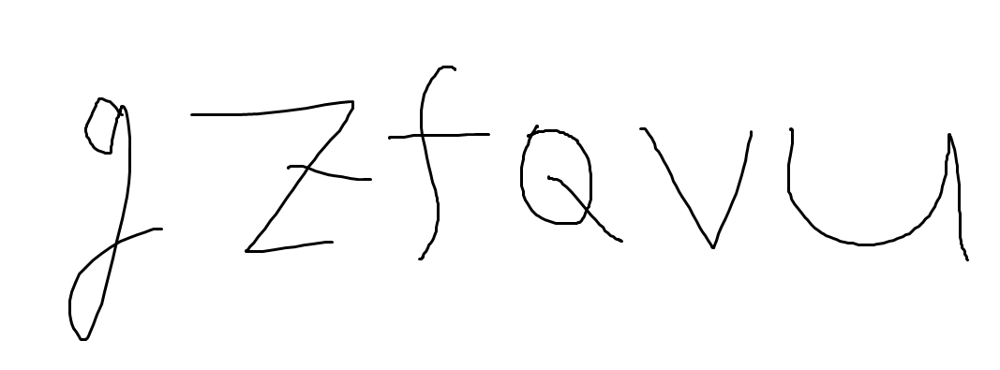
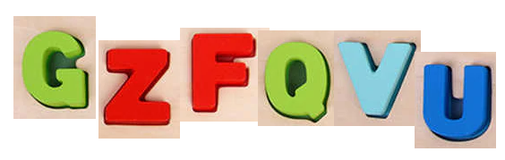
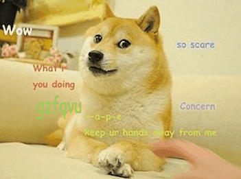
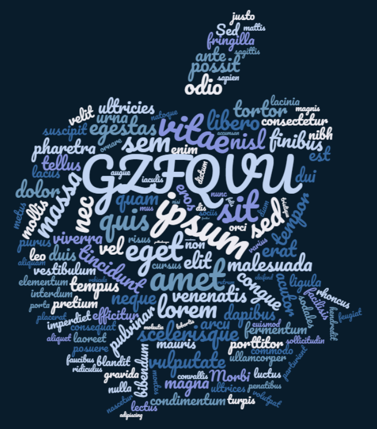

# can-google-ocr-this

## Motivation

https://twitter.com/veydpz_public/status/1377960373098225677 (in Korean)

Looks like Google is possible to recognize characters in arbitrary images/videos, and show them on search results.

Here, I aim to check whether certain keywords can be recognized from Google.
I'll try to produce hard examples as possible.

## Examples

mspaint

---

baby-toy

---

doge (gif)

---

word cloud

